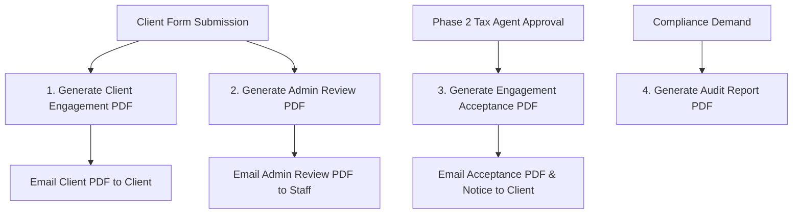

# 📄 PDF Generation Engine - Technical Implementation Plan (Part 20 Spec)

This implementation plan strictly follows **`Part_20_PDF_Generation_Specification.docx`**.

It defines the architecture, database tracking, Puppeteer HTML templates, storage conventions, and email workflows for 4 specialized PDFs in the **New Individual Client Engagement System**.

---

## 📌 Executive Summary & PDF Types



### 1. `Client Engagement PDF` (`NENG-YYYY-XXXXXX_Client_Engagement.pdf`)

- **Recipient:** Client (immediate submission receipt).
- **Contents:** Cover page, Reference number, Client identity, Selected services, Complete 10-step wizard answers, Uploaded file manifest, ATO & refund bank authorities, Statutory legal consents, Drawn/typed electronic signature, Terms & Conditions, Footer with page numbers.
- **Privacy Rule:** Excludes internal notes, risk ratings, AML/CTF notes, sanctions, and reviewer comments. Masked TFNs (`*** *** 789`) and bank numbers (`****5678`).

### 2. `Admin Review PDF` (`NENG-YYYY-XXXXXX_Admin_Review.pdf`)

- **Recipient:** Internal Staff / Tax Accountants.
- **Contents:** Everything in Client PDF + Full submission metadata, Identity verification summary, Missing documents checklist, Section 3 Review Checklist (`ADM-001` to `ADM-010`), Section 4 Risk Assessment (`Low`, `Medium`, `High`, `Unacceptable`), Section 5 AML/CTF review, Section 6 Sanctions review, Tax Agent reviewer notes, Assigned accountant details.

### 3. `Engagement Acceptance PDF` (`NENG-YYYY-XXXXXX_Engagement_Acceptance.pdf`)

- **Recipient:** Client (sent upon Tax Agent approval in `/admin/individual-engagement-new`).
- **Contents:** Accepted services, Scope of work, Fee schedule, Lodgement deadlines, Final terms, Client signature, Tax Agent countersignature stamp, Official acceptance date.

### 4. `Audit Report PDF` (`NENG-YYYY-XXXXXX_Audit_Report.pdf`)

- **Recipient:** Compliance & Internal Auditors (generated on demand).
- **Contents:** Complete audit log timeline, Email delivery logs, Status history, Review history, Risk assessment history.

---

## 💾 Database Schema (`new_individual_pdfs`)

We will create a dedicated model `NewIndividualPdf` mapped to `new_individual_pdfs`:

```sql
CREATE TABLE new_individual_pdfs (
  id BIGINT AUTO_INCREMENT PRIMARY KEY,
  engagementId BIGINT NOT NULL,
  type ENUM('ClientEngagement', 'AdminReview', 'EngagementAcceptance', 'AuditReport') NOT NULL,
  fileName VARCHAR(255) NOT NULL,
  filePath TEXT NOT NULL,
  version INT NOT NULL DEFAULT 1,
  templateVersion VARCHAR(20) NOT NULL DEFAULT 'v1.0.0',
  generatedBy VARCHAR(100) NOT NULL DEFAULT 'System',
  generatedAt DATETIME NOT NULL DEFAULT CURRENT_TIMESTAMP,
  emailSent BOOLEAN NOT NULL DEFAULT FALSE,
  emailSentAt DATETIME NULL,
  FOREIGN KEY (engagementId) REFERENCES new_individual_engagements(id) ON DELETE CASCADE
);
```

---

## 🛠️ Puppeteer PDF Templates & Modular Architecture

We will organize PDF templates cleanly under `financially-up-backend/pdf/templates/`:

```
financially-up-backend/
├── pdf/
│   ├── templates/
│   │   ├── clientEngagementTemplate.js
│   │   ├── adminReviewTemplate.js
│   │   ├── engagementAcceptanceTemplate.js
│   │   └── auditReportTemplate.js
│   └── components/
│       ├── pdfHeader.js
│       ├── pdfFooter.js
│       └── pdfSignatureStamp.js
```

### Key PDF Formatting Rules:

- **A4 Layout with Page Numbers:** Includes CSS `@page` page counters (`Page X of Y`).
- **Header & Branding:** Premium emerald/slate headers featuring Financially Up logo, registered office address (`Level 5, 100 Walker St, North Sydney NSW 2060`), and phone (`1300 328 316`).
- **Signature Stamp:** Embeds relative file paths to PNG signature drawings stored in `/public/uploads/signatures/` with ETA 1999 legal binding note.

---

## 📧 Email Integration & Automation Workflow

1. **On Client Submission (`POST /api/new-individual-engagements`):**
   - Generate `ClientEngagement` PDF -> Save to `new_individual_pdfs` -> Email client receipt with attachment.
   - Generate `AdminReview` PDF -> Save to `new_individual_pdfs` -> Email staff alert with attachment.

2. **On Admin Acceptance (`PUT /api/admin/new-individual-engagements/:id/decision`):**
   - Generate `EngagementAcceptance` PDF (with Tax Agent countersignature) -> Save to `new_individual_pdfs` -> Email client acceptance notice with attachment.

---

## 📂 Proposed Code Additions

### `financially-up-backend`

#### [NEW] [`models/NewIndividualPdf.js`](file:///d:/xampp/htdocs/myProjects/nextjs/financially-up/financially-up-backend/models/NewIndividualPdf.js)

- Sequelize model for `new_individual_pdfs` table.

#### [MODIFY] [`models/index.js`](file:///d:/xampp/htdocs/myProjects/nextjs/financially-up/financially-up-backend/models/index.js)

- Register `NewIndividualPdf` and associate `NewIndividualEngagement.hasMany(NewIndividualPdf)`.

#### [NEW] [`pdf/templates/clientEngagementTemplate.js`](file:///d:/xampp/htdocs/myProjects/nextjs/financially-up/financially-up-backend/pdf/templates/clientEngagementTemplate.js)

#### [NEW] [`pdf/templates/adminReviewTemplate.js`](file:///d:/xampp/htdocs/myProjects/nextjs/financially-up/financially-up-backend/pdf/templates/adminReviewTemplate.js)

#### [NEW] [`pdf/templates/engagementAcceptanceTemplate.js`](file:///d:/xampp/htdocs/myProjects/nextjs/financially-up/financially-up-backend/pdf/templates/engagementAcceptanceTemplate.js)

#### [NEW] [`pdf/templates/auditReportTemplate.js`](file:///d:/xampp/htdocs/myProjects/nextjs/financially-up/financially-up-backend/pdf/templates/auditReportTemplate.js)

#### [MODIFY] [`services/individualPdf.service.js`](file:///d:/xampp/htdocs/myProjects/nextjs/financially-up/financially-up-backend/services/individualPdf.service.js)

- Implement `generateClientEngagementPDF`, `generateAdminReviewPDF`, `generateEngagementAcceptancePDF`, and `generateAuditReportPDF` using Puppeteer and saving records into `new_individual_pdfs`.

#### [MODIFY] [`controllers/newIndividualEngagement.controller.js`](file:///d:/xampp/htdocs/myProjects/nextjs/financially-up/financially-up-backend/controllers/newIndividualEngagement.controller.js)

- Trigger `ClientEngagement` and `AdminReview` PDF generation on submission.
- Trigger `EngagementAcceptance` PDF generation on Tax Agent approval.

---

## 🧪 Verification Plan

### Automated / API Verification

- Submit client form -> Verify `NENG-YYYY-XXXXXX_Client_Engagement.pdf` and `NENG-YYYY-XXXXXX_Admin_Review.pdf` created in `/public/uploads/pdf/`.
- Verify 2 records created in `new_individual_pdfs` database table.
- Execute Phase 2 Admin decision -> Verify `NENG-YYYY-XXXXXX_Engagement_Acceptance.pdf` created with Tax Agent countersignature.

### Manual Verification

- Open PDF URLs in browser (`http://localhost:5000/uploads/pdf/...`).
- Verify page numbers, logo, signature image, and terms rendering crisply in A4 format.
