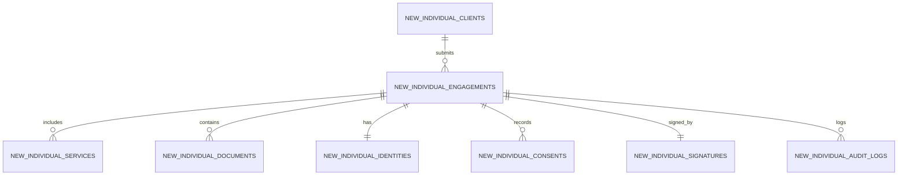

# 🛠️ Backend Implementation Plan — New Individual Client Engagement System

> [!IMPORTANT]
> **Strict Code Isolation Rule:**  
> The existing production files (`models/IndividualEngagement.js`, `controllers/individualEngagement.controller.js`, `routes/individualEngagement.routes.js`, the `individual_engagements` database table, and `/admin/individual-engagement` admin page) serve the live legacy website and **WILL NOT BE TOUCHED OR MODIFIED**.  
> The new form will use dedicated `new_individual_*` models and database tables, with Phase 2 Admin review on `/admin/individual-engagement-new`.

---

## 📌 Executive Summary

This plan details the backend technical architecture for the **New Individual Client Engagement System** as specified in `agent-data/Individual-Engagement-form` (Parts 1–18):

1. **Submission API:** Payload (form fields, base64 signature, uploaded files) is validated and stored across normalized MySQL tables (`new_individual_*`).
2. **Reusable File & Signature Processing:** Base64 signature canvas data is converted to PNG image files stored securely in `/public/uploads/signatures/`, and uploaded files are saved in `/public/uploads/documents/`.
3. **PDF Generation:** Puppeteer renders a professional, branded **Client Engagement PDF** (with Engagement Schedule, Terms & Signature) and an **Admin Review PDF**.
4. **Email Dispatch:** Nodemailer sends a receipt email with attached PDF to the client and a review alert to Financially Up staff.
5. **Phase 2 Execution:** Tax Agents review, run TPB identity & ATO portal checks, and countersign the engagement in `/admin/individual-engagement-new`.

---

## 🏛️ Database Schema & Sequelize Models (`financially-up-backend/models`)

We will create 8 isolated `NewIndividual*` Sequelize models mapped to `new_individual_*` tables:

### Table Specifications & Fields:

1. **`new_individual_clients`**
   - `id` (BIGINT PK AUTO_INCREMENT)
   - `fullName` (VARCHAR 150)
   - `email` (VARCHAR 255 UNIQUE INDEX)
   - `mobile` (VARCHAR 30)
   - `dateOfBirth` (DATE)
   - `birthCountry` (VARCHAR 100)
   - `birthCity` (VARCHAR 100)
   - `occupation` (VARCHAR 150)
   - `employmentStatus` (VARCHAR 100)
   - `maskedTfn` (VARCHAR 20) — Encrypted / Masked (e.g. `*** *** 789`)

2. **`new_individual_engagements`** (Master Record)
   - `id` (BIGINT PK AUTO_INCREMENT)
   - `clientId` (FK -> `new_individual_clients.id`)
   - `referenceNumber` (VARCHAR 50 UNIQUE) e.g. `NENG-2026-0091`
   - `status` (ENUM: `Pending Review`, `Accepted`, `Conditional Accept`, `Request Information`, `Declined`)
   - `entityService` (VARCHAR 10) — `No`, `Yes`, `Unsure`
   - `isAustralianCitizen` (BOOLEAN)
   - `taxResidency` (VARCHAR 50)
   - `hasPreviousName` / `previousNames`
   - `address` / `postalAddress`
   - `hasSpouse` / `spouseName` / `spouseDob` / `spouseIncome` / `prepareSpouseReturn`
   - `hasDependants` / `dependantCount`
   - `hadPreviousAccountant` / `previousFirm` / `reasonForChange`
   - `atoIssues` / `atoExplanation` / `noticeDate` / `dueDate`
   - `isSelf` / `repName` / `relationship` / `authorityDesc`
   - `needBank` / `accountName` / `bsb` / `accountNumber` / `confirmOwnership`
   - `riskLevel` (ENUM: `Low`, `Medium`, `High`, `Unacceptable`)
   - `pdfPath` (TEXT)
   - `submittedAt` (DATETIME)

3. **`new_individual_services`**
   - `id` (BIGINT PK)
   - `engagementId` (FK -> `new_individual_engagements.id`)
   - `serviceName` (VARCHAR 100) e.g. `Individual Tax Return`, `Sole Trader BAS`, `ABN Application`

4. **`new_individual_identities`**
   - `id` (BIGINT PK)
   - `engagementId` (FK -> `new_individual_engagements.id`)
   - `identityMethod` (VARCHAR 50) — `Upload ID`, `Electronic Verification`, `Live Video`, `In Person`, `No Photo ID`
   - `primaryIdPath` / `supportingIdPath` / `selfiePath`
   - `noPhotoIdReason` (TEXT)
   - `biometricConsent` (BOOLEAN)
   - `dvsStatus` (VARCHAR 50) — `Pass`, `Pending`, `Manual Review`

5. **`new_individual_documents`**
   - `id` (BIGINT PK)
   - `engagementId` (FK -> `new_individual_engagements.id`)
   - `documentCategory` (VARCHAR 50) — `Visa`, `ATO Notice`, `Authority Document`, `ID Document`
   - `fileName` / `filePath` / `fileSize` / `mimeType`

6. **`new_individual_consents`**
   - `id` (BIGINT PK)
   - `engagementId` (FK -> `new_individual_engagements.id`)
   - `consentType` (VARCHAR 100) — `ScheduleTerms`, `PrivacyNotice`, `AtoAuthority`, `AbrAuthority`, `CloudProcessing`
   - `accepted` (BOOLEAN)
   - `acceptedAt` (DATETIME)

7. **`new_individual_signatures`**
   - `id` (BIGINT PK)
   - `engagementId` (FK -> `new_individual_engagements.id`)
   - `signerType` (ENUM: `Client`, `TaxAgent`)
   - `signerFullName` (VARCHAR 150)
   - `signatureMethod` (ENUM: `draw`, `type`, `upload`)
   - `signatureFilePath` (TEXT) — Stored PNG file path
   - `ipAddress` (VARCHAR 45)
   - `userAgent` (TEXT)
   - `bindingConfirmed` (BOOLEAN) — ETA 1999 consent

8. **`new_individual_audit_logs`**
   - `id` (BIGINT PK)
   - `engagementId` (FK -> `new_individual_engagements.id`)
   - `action` (VARCHAR 255)
   - `performedBy` (VARCHAR 100)
   - `timestamp` (DATETIME)

---

## 📁 Shared File & Signature Storage (`financially-up-backend/middleware/upload.js` & `services/storage.service.js`)

1. **Multer Middleware (`middleware/upload.js`):** Generic, reusable file upload middleware for all engagement forms.
   - Storage path: `/public/uploads/documents/YYYY/MM/`
2. **Signature Storage:** Base64 canvas signature decoder converting client/staff signatures to PNG images in `/public/uploads/signatures/`.
3. **Generated PDF Storage:** Stores generated PDFs in `/public/uploads/pdf/`.

---

## 📄 PDF Generation Engine (`financially-up-backend/services/individualPdf.service.js`)

Uses **Puppeteer**:
- `generateClientEngagementPDF(engagementId)`: Produces a 4-page branded PDF containing:
  - Header with Financially Up logo & company contact details (`Level 5, 100 Walker St, North Sydney NSW 2060`, `1300 328 316`).
  - Section 1: Client Information & Tax Profile.
  - Section 2: Engagement Schedule (Scope of Work & Fee Schedule).
  - Section 3: Statutory Legal Consents & ATO Authority Declarations.
  - Section 4: Electronic Signature Stamp & Audit Details.
- *Security Rule:* TFNs are masked (`*** *** 789`) and bank account numbers are masked (`****5678`). Internal notes & risk ratings are excluded from client PDF.

---

## 📧 Email Notification Workflow (`financially-up-backend/services/individualEmail.service.js`)

Uses **Nodemailer** with HTML email templates:
1. **Client Submission Receipt:**
   - Subject: `Engagement Application Received - Financially Up (Ref: NENG-2026-XXXX)`
   - Attachment: `Client_Engagement_Notice.pdf`
   - Content: Informs client that application is in **Pending Review** status.
2. **Admin Review Alert:**
   - Subject: `[ACTION REQUIRED] New Client Engagement: John Smith (NENG-2026-XXXX)`
   - Direct link to Admin Portal `/admin/individual-engagement-new`.
3. **Written Acceptance Notice (Phase 2):**
   - Dispatched automatically when Tax Agent approves the engagement.

---

## 🔌 API Endpoints & Routes (`routes/newIndividualEngagement.routes.js`)

- `POST /api/new-individual-engagements`: Client form submission endpoint.
- `GET /api/new-individual-engagements`: Admin listing endpoint for `/admin/individual-engagement-new`.
- `GET /api/new-individual-engagements/:id`: Details endpoint.
- `PUT /api/admin/new-individual-engagements/:id/decision`: Phase 2 Tax Agent review, checklist, and countersignature endpoint.

---

## 📂 Proposed File Additions

### `financially-up-backend`

#### [NEW] [`models/NewIndividualClient.js`](file:///d:/xampp/htdocs/myProjects/nextjs/financially-up/financially-up-backend/models/NewIndividualClient.js)
#### [NEW] [`models/NewIndividualEngagement.js`](file:///d:/xampp/htdocs/myProjects/nextjs/financially-up/financially-up-backend/models/NewIndividualEngagement.js)
#### [NEW] [`models/NewIndividualService.js`](file:///d:/xampp/htdocs/myProjects/nextjs/financially-up/financially-up-backend/models/NewIndividualService.js)
#### [NEW] [`models/NewIndividualIdentity.js`](file:///d:/xampp/htdocs/myProjects/nextjs/financially-up/financially-up-backend/models/NewIndividualIdentity.js)
#### [NEW] [`models/NewIndividualDocument.js`](file:///d:/xampp/htdocs/myProjects/nextjs/financially-up/financially-up-backend/models/NewIndividualDocument.js)
#### [NEW] [`models/NewIndividualConsent.js`](file:///d:/xampp/htdocs/myProjects/nextjs/financially-up/financially-up-backend/models/NewIndividualConsent.js)
#### [NEW] [`models/NewIndividualSignature.js`](file:///d:/xampp/htdocs/myProjects/nextjs/financially-up/financially-up-backend/models/NewIndividualSignature.js)
#### [NEW] [`models/NewIndividualAuditLog.js`](file:///d:/xampp/htdocs/myProjects/nextjs/financially-up/financially-up-backend/models/NewIndividualAuditLog.js)
#### [NEW] [`middleware/upload.js`](file:///d:/xampp/htdocs/myProjects/nextjs/financially-up/financially-up-backend/middleware/upload.js)
#### [NEW] [`services/storage.service.js`](file:///d:/xampp/htdocs/myProjects/nextjs/financially-up/financially-up-backend/services/storage.service.js)
#### [NEW] [`services/individualPdf.service.js`](file:///d:/xampp/htdocs/myProjects/nextjs/financially-up/financially-up-backend/services/individualPdf.service.js)
#### [NEW] [`services/individualEmail.service.js`](file:///d:/xampp/htdocs/myProjects/nextjs/financially-up/financially-up-backend/services/individualEmail.service.js)
#### [NEW] [`controllers/newIndividualEngagement.controller.js`](file:///d:/xampp/htdocs/myProjects/nextjs/financially-up/financially-up-backend/controllers/newIndividualEngagement.controller.js)
#### [NEW] [`routes/newIndividualEngagement.routes.js`](file:///d:/xampp/htdocs/myProjects/nextjs/financially-up/financially-up-backend/routes/newIndividualEngagement.routes.js)
#### [MODIFY] [`app.js`](file:///d:/xampp/htdocs/myProjects/nextjs/financially-up/financially-up-backend/app.js) — Register `/api/new-individual-engagements` route without touching existing routes.

---

### `financially-up-frontend`

#### [NEW] [`app/admin/individual-engagement-new/page.js`](file:///d:/xampp/htdocs/myProjects/nextjs/financially-up/financially-up-frontend/app/admin/individual-engagement-new/page.js)
- Dedicated Admin page for the New Individual Engagement Form.

#### [NEW] [`services/newIndividualEngagement.service.js`](file:///d:/xampp/htdocs/myProjects/nextjs/financially-up/financially-up-frontend/services/newIndividualEngagement.service.js)
- Dedicated frontend client service connecting `/resources/engagement-forms/individual-engagement-form` and `/admin/individual-engagement-new` to `/api/new-individual-engagements`.

---

## 🧪 Verification Plan

### Automated / API Verification
- Submit form to `POST /api/new-individual-engagements`.
- Verify database tables `new_individual_*` populated.
- Verify files stored in `/public/uploads/documents/` and signatures in `/public/uploads/signatures/`.
- Verify legacy production code, tables, and `/admin/individual-engagement` page remain untouched.

### Manual Verification
- Test client submission at `/resources/engagement-forms/individual-engagement-form`.
- Test Phase 2 Admin review and countersignature execution at `/admin/individual-engagement-new`.
