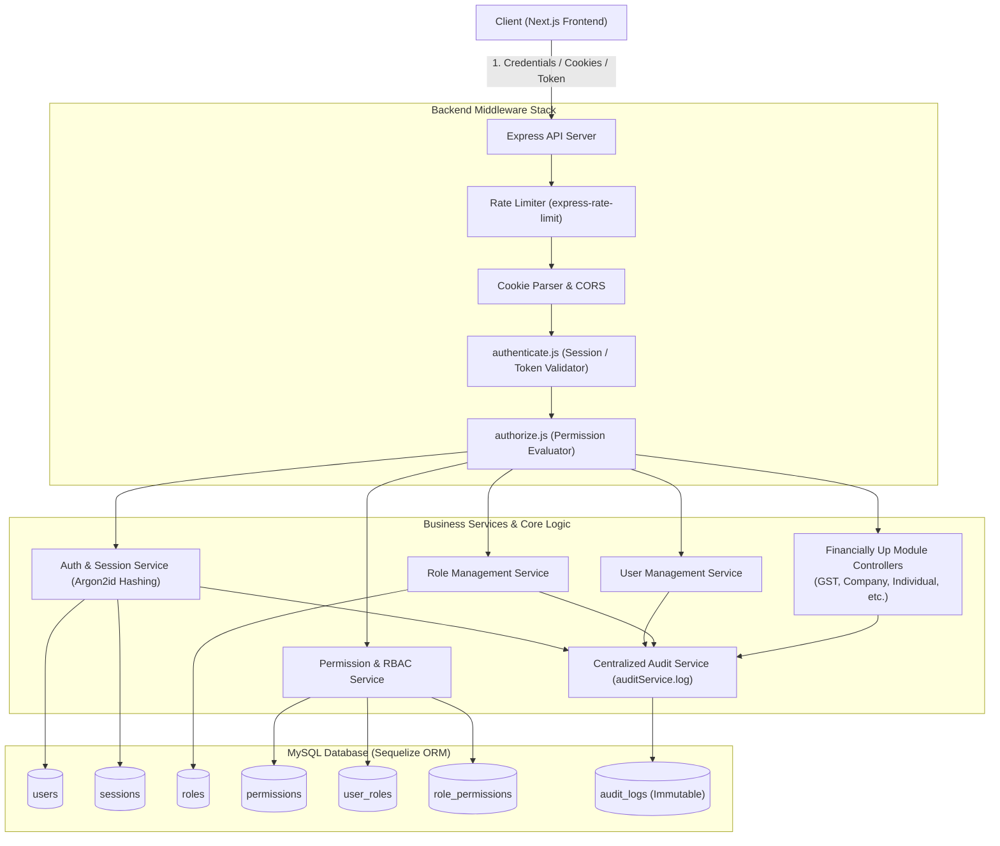
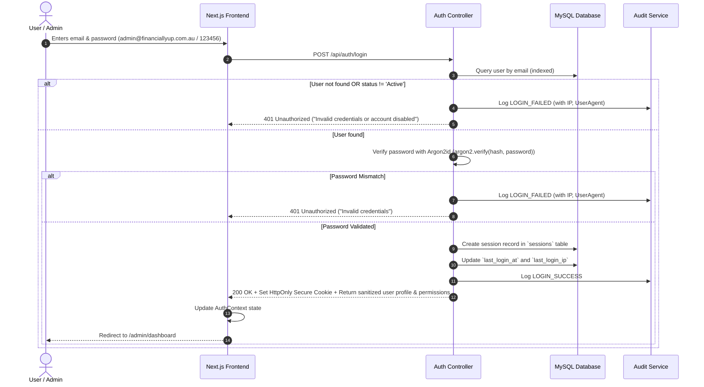
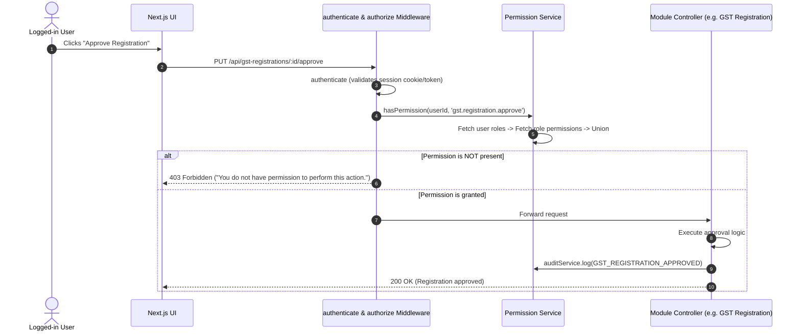

# Implementation Plan - Dynamic RBAC, User Management, Secure Sessions & Audit Logging (Argon2id)

Based on the official **Financially Up ERP RBAC Specification** (`financially-up-backend/agent-data/Financially-Up-ERP-RBAC-Specification.docx`), this implementation plan details the architecture, data models, security controls, API design, diagrams, and frontend interfaces for a production-ready, dynamic authorization system utilizing **Argon2id** for state-of-the-art password hashing.

---

## 1. System Architecture & Workflows

### 1.1 High-Level Architecture Diagram

---

### 1.2 Authentication & Session Flow (Login & Verification with Argon2id)

---

### 1.3 Dynamic Permission Resolution Flow

---

## 2. Packages Required

### Backend Packages (`financially-up-backend`)
| Package | Version | Purpose |
| :--- | :--- | :--- |
| `argon2` | `^0.41.1` | **Argon2id** password hashing and verification (PHC winner, memory-hard, GPU/ASIC-resistant) |
| `jsonwebtoken` | `^9.0.2` | Signed JWT token generation & verification for sessions |
| `cookie-parser` | `^1.4.7` | Parsing and handling secure `HttpOnly` session cookies |
| `express-rate-limit` | `^7.4.1` | Brute-force protection on `/api/auth/*` endpoints |

### Frontend Packages (`financially-up-frontend`)
- All required UI libraries (`antd`, `@ant-design/icons`, `tailwindcss`) are already installed and configured.

---

## 3. Database Schema Design (Sequelize Models)

### 3.1 `user_main`
- `id` (BIGINT, PK, Auto-increment)
- `uuid` (UUID, Unique, Default: UUIDV4)
- `email` (STRING(150), Unique, Indexed)
- `password_hash` (STRING(255), Not Null) — *Argon2id encoded hash string*
- `first_name` (STRING(100), Not Null)
- `last_name` (STRING(100), Not Null)
- `phone` (STRING(30), Nullable)
- `department` (STRING(100), Nullable)
- `job_title` (STRING(100), Nullable)
- `bio` (TEXT, Nullable)
- `avatar` (TEXT, Nullable)
- `status` (ENUM('Active', 'Inactive', 'Suspended'), Default: 'Active', Indexed)
- `email_verified_at` (DATE, Nullable)
- `last_login_at` (DATE, Nullable)
- `last_login_ip` (STRING(45), Nullable)
- `created_at`, `updated_at`, `deleted_at` (Paranoid Soft Deletion)

### 3.2 `user_roles`
- `id` (BIGINT, PK, Auto-increment)
- `uuid` (UUID, Unique)
- `name` (STRING(100), Not Null)
- `slug` (STRING(100), Unique, Indexed)
- `description` (TEXT, Nullable)
- `is_system` (BOOLEAN, Default: false)
- `status` (ENUM('Active', 'Inactive'), Default: 'Active')
- `created_by` (BIGINT, Nullable)
- `created_at`, `updated_at`

### 3.3 `user_permissions`
- `id` (BIGINT, PK, Auto-increment)
- `module` (STRING(100), Indexed) — e.g. `users`, `roles`, `gst`, `company`, `engagement`, `documents`, `pdf`, `audit`
- `resource` (STRING(100)) — e.g. `registration`, `profile`, `session`, `report`
- `action` (STRING(50)) — e.g. `view`, `create`, `edit`, `delete`, `review`, `approve`, `export`, `download`
- `name` (STRING(150), Not Null)
- `slug` (STRING(150), Unique, Indexed) — e.g. `gst.registration.view`, `company.registration.approve`
- `description` (TEXT, Nullable)
- `created_at`, `updated_at`

### 3.4 `user_main_roles` (Join Table)
- `id` (BIGINT, PK, Auto-increment)
- `user_id` (BIGINT, FK -> user_main.id, Indexed)
- `role_id` (BIGINT, FK -> user_roles.id, Indexed)
- `assigned_by` (BIGINT, Nullable)
- `created_at`
- *Unique Constraint*: `[user_id, role_id]`

### 3.5 `user_role_permissions` (Join Table)
- `id` (BIGINT, PK, Auto-increment)
- `role_id` (BIGINT, FK -> user_roles.id, Indexed)
- `permission_id` (BIGINT, FK -> user_permissions.id, Indexed)
- `created_at`
- *Unique Constraint*: `[role_id, permission_id]`

### 3.6 `user_sessions`
- `id` (BIGINT, PK, Auto-increment)
- `uuid` (UUID, Unique)
- `user_id` (BIGINT, FK -> user_main.id, Indexed)
- `session_token_hash` (STRING(255), Indexed)
- `ip_address` (STRING(45), Nullable)
- `user_agent` (TEXT, Nullable)
- `device_name` (STRING(100), Nullable)
- `expires_at` (DATE, Indexed)
- `last_activity_at` (DATE, Nullable)
- `revoked_at` (DATE, Nullable)
- `created_at`

### 3.7 `user_audit_logs` (Immutable)
- `id` (BIGINT, PK, Auto-increment)
- `uuid` (UUID, Unique)
- `actor_user_id` (BIGINT, Nullable, Indexed)
- `target_user_id` (BIGINT, Nullable, Indexed)
- `action` (STRING(100), Indexed)
- `module` (STRING(100), Indexed)
- `resource_type` (STRING(100), Nullable)
- `resource_id` (STRING(100), Nullable, Indexed)
- `description` (TEXT, Nullable)
- `before_data` (JSON, Nullable) — *Sensitive fields stripped/masked*
- `after_data` (JSON, Nullable) — *Sensitive fields stripped/masked*
- `ip_address` (STRING(45), Nullable)
- `user_agent` (TEXT, Nullable)
- `request_id` (STRING(100), Nullable)
- `status` (ENUM('SUCCESS', 'FAILURE'), Default: 'SUCCESS', Indexed)
- `error_message` (TEXT, Nullable)
- `created_at` (DATE, Indexed)

---

## 4. Proposed Changes by Phase

### Phase 1: Backend Database & Seeding
- Install `argon2`, `jsonwebtoken`, `cookie-parser`, `express-rate-limit`.
- Create password hashing utility (`utils/password.js` using `argon2.hash(pwd, { type: argon2.argon2id })` and `argon2.verify(hash, pwd)`).
- Create Sequelize models:
  - `models/User.js`
  - `models/Role.js`
  - `models/Permission.js`
  - `models/UserRole.js`
  - `models/RolePermission.js`
  - `models/Session.js`
  - `models/AuditLog.js`
- Define associations in `models/index.js`.
- Create seed utility `utils/rbacSeed.js` to initialize:
  - Default permissions for all modules (`users`, `roles`, `audit`, `gst`, `company`, `individual`, `documents`, `pdf`, `medicare`, `trust`, `smsf`, `business_names`).
  - Default system roles (`Administrator`, `Accountant`, `Reviewer`, `Viewer`).
  - Default admin user: `admin@financiallyup.com.au` / `123456` hashed with **Argon2id** and assigned to `Administrator`.

### Phase 2: Centralized Services & Security Middleware
- Create `services/audit.service.js` with `auditService.log({...})`.
- Create `services/permission.service.js` with `hasPermission`, `getUserRoles`, `getUserPermissions`.
- Create `middleware/authenticate.js` (reads cookie/Bearer, verifies session in DB, checks user status, attaches `req.user`).
- Create `middleware/authorize.js` (`authorize(permission)`, `authorizeAny([...])`, `authorizeAll([...])`).
- Create `middleware/rateLimiter.js` for brute force defense on auth routes.

### Phase 3: Backend API Controllers & Routes
- Auth Controller & Routes (`controllers/auth.controller.js`, `routes/auth.routes.js`):
  - `POST /api/auth/login` (Rate limited, Argon2id verification, audits LOGIN_SUCCESS / LOGIN_FAILED, sets HttpOnly cookie & returns user).
  - `POST /api/auth/logout` (Revokes current session, clears cookie).
  - `GET  /api/auth/me` (Returns current user, roles, permissions).
  - `PUT  /api/auth/profile` (Updates profile details, avatar upload).
  - `PUT  /api/auth/change-password` (Validates current password via Argon2id, hashes new password with Argon2id, revokes other sessions).
- User Management Controller & Routes (`controllers/user.controller.js`, `routes/user.routes.js`):
  - `GET    /api/users` (`users.view`)
  - `POST   /api/users` (`users.create`)
  - `GET    /api/users/:id` (`users.view`)
  - `PUT    /api/users/:id` (`users.edit`)
  - `PATCH  /api/users/:id/status` (`users.disable`)
  - `PUT    /api/users/:id/roles` (`users.roles.manage`)
  - `GET    /api/users/:id/activity` (`users.activity.view`)
  - `GET    /api/users/:id/sessions` (`users.sessions.manage`)
  - `DELETE /api/users/:id/sessions/:sessionId` (`users.sessions.manage`)
  - `DELETE /api/users/:id/sessions` (`users.sessions.manage`)
- Role Management Controller & Routes (`controllers/role.controller.js`, `routes/role.routes.js`):
  - `GET    /api/roles` (`roles.view`)
  - `POST   /api/roles` (`roles.create`)
  - `GET    /api/roles/:id` (`roles.view`)
  - `PUT    /api/roles/:id` (`roles.edit`)
  - `DELETE /api/roles/:id` (`roles.delete`)
  - `GET    /api/roles/:id/permissions` (`roles.view`)
  - `PUT    /api/roles/:id/permissions` (`roles.edit`)
- Permissions Controller & Routes (`controllers/permission.controller.js`, `routes/permission.routes.js`):
  - `GET    /api/permissions` (`roles.view`)
- Audit Log Controller & Routes (`controllers/audit.controller.js`, `routes/audit.routes.js`):
  - `GET    /api/audit-logs` (`audit.view`)
  - `GET    /api/audit-logs/:id` (`audit.view`)

### Phase 4: Frontend Services, Context & Permissions
- Create `services/auth.service.js`, `services/user.service.js`, `services/role.service.js`, `services/audit.service.js`.
- Update `services/apiConfig.js` to include credentials (`include` cookies), handle 401/403.
- Create `context/AuthContext.js` with `user`, `roles`, `permissions`, `can(permission)`, `login`, `logout`.
- Update `app/admin/login/page.js` to connect to real API login.
- Update `components/admin/Header.js` with real avatar, name, role badge, profile link, and logout.
- Update `components/admin/Sidebar.js` to conditionally display module links based on user permissions (`can(...)`).

### Phase 5: Frontend Admin Screens
- **My Profile Page**: `/admin/profile` (Tabs: Profile, Security, Sessions, My Activity).
- **User Management Page**: `/admin/users` (Table, search, filters, create user modal, status toggle, actions).
- **User Details Page**: `/admin/users/[id]` (Tabs: Overview, Roles & Permissions, Activity, Active Sessions).
- **Role Management Page**: `/admin/roles` (Table of roles with user & permission counts, system badge, actions).
- **Role Create/Edit Page**: `/admin/roles/new` & `/admin/roles/[id]` (Grouped categorized permission checkboxes with Select All / Clear All per module).
- **Audit Log Page**: `/admin/audit-logs` (Filtered log table, date range, action filters, detail drawer with before/after diffs).

---

## 5. Verification & Testing Plan

### 5.1 Automated Testing
1. **Backend Integration Tests**:
   - Seed verification: `admin@financiallyup.com.au` exists, password hash is verified with `argon2.verify()`, role is `Administrator`.
   - Login rate limit test (blocks excessive failed attempts).
   - Session revocation test (revoked session token returns 401).
   - Permission rejection test (Accountant role receives 403 on user creation or role modification).
2. **Frontend Linter**:
   - Run `npx eslint` across all newly created components and routes.

### 5.2 End-to-End Verification Flow
1. **Login & Session**:
   - Log in with `admin@financiallyup.com.au` / `123456`.
   - Verify redirect to `/admin/dashboard` and presence of secure session.
2. **Profile & Edit**:
   - Navigate to `/admin/profile` -> update phone, bio, avatar -> save and verify DB & Audit Log updates.
3. **Role & Permission Management**:
   - Create new custom role `Tax Reviewer` -> assign specific GST & Company review permissions -> verify audit record.
4. **User Management**:
   - Create new user `accountant@financiallyup.com.au` -> assign `Accountant` role.
   - Log in as accountant -> verify restricted sidebar navigation and verified 403 on unauthorized API endpoints.
5. **Audit Logs & Sessions**:
   - Open `/admin/audit-logs` -> verify actor, target, timestamp, IP, and details drawer for all actions performed.
   - Check active sessions -> revoke a session -> verify instant logout on that session.
