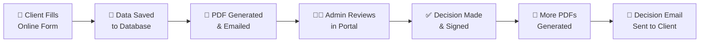
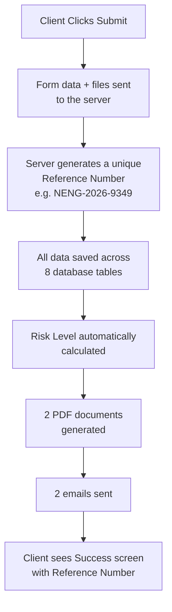
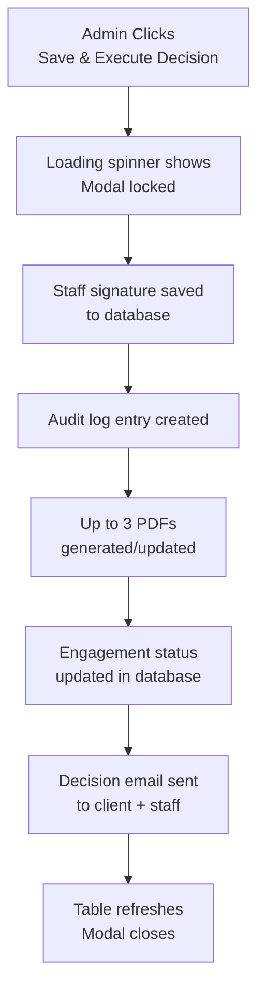
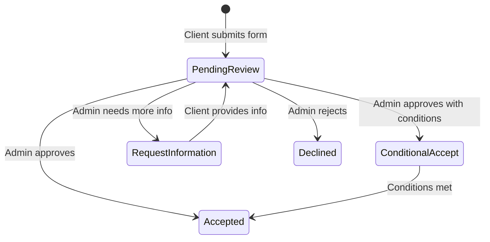

# New Individual Engagement - Complete System Flow

> A simple, step-by-step guide explaining how the **New Individual Client Engagement** system works from start to finish.

---

## Overview (The Big Picture)

This system handles the entire journey of onboarding a new individual tax client - from the moment they fill out the form on your website, all the way through to the Tax Agent approving their engagement, generating official PDF documents, and sending confirmation emails.

There are **two main phases**:

| Phase                           | Who Does It                                 | What Happens                                                                |
| ------------------------------- | ------------------------------------------- | --------------------------------------------------------------------------- |
| **Phase 1 - Client Submission** | The Client (on the website)                 | Fills out a 10-step form, uploads ID, signs electronically                  |
| **Phase 2 - Tax Agent Review**  | The Tax Agent / Admin (in the admin portal) | Reviews the submission, runs compliance checks, makes a decision, signs off |

---

## Phase 1: Client Submits the Form (Website)

### Where It Lives

The client fills out the form on your public website at:
**`/resources/engagement-forms/individual-engagement-form`**

### What the Client Sees - 10 Steps

The form is broken into **10 easy steps** with a progress bar at the top. The client can save their progress and come back later (it auto-saves to their browser).

| Step   | Title                   | What the Client Fills In                                                                                                         |
| ------ | ----------------------- | -------------------------------------------------------------------------------------------------------------------------------- |
| **1**  | Service Selection       | Which services they need (e.g. Individual Tax Return, BAS, Bookkeeping) and whether they need entity services                    |
| **2**  | Personal Details        | Full name, date of birth, phone, email, address, occupation, employment status, TFN                                              |
| **3**  | Residency & Family      | Australian citizenship, tax residency status, visa details (if applicable), spouse info, dependants, previous accountant details |
| **4**  | Income & Tax Profile    | ATO issues, overdue obligations, notice dates                                                                                    |
| **5**  | Sole Trader / BAS / GST | ABN, BAS period, GST status, business details, payroll info (only if applicable)                                                 |
| **6**  | ID Verification         | Upload Primary Photo ID (e.g. Passport, Driver Licence), Supporting ID, and optionally a selfie                                  |
| **7**  | ATO & Bank Authorities  | Who is acting on their behalf (self or representative), ATO authority documents, bank account details for refunds                |
| **8**  | Fee Schedule            | View the full engagement schedule and scope of services (must click to view before proceeding)                                   |
| **9**  | Legal Agreements        | Accept terms & conditions, privacy notice, ATO authority consent, biometric consent                                              |
| **10** | E-Signature & Submit    | Draw signature on screen, type their name, or upload a signature image - then click Submit                                       |

### What Happens When They Click "Submit"

When the client clicks the **Submit** button on Step 10, here is exactly what happens behind the scenes:

#### Step-by-Step Breakdown:

**1. Data is sent to the server**
All the form answers, uploaded files (ID documents, visa evidence, signature), and consent records are packaged and sent to the backend server.

**2. A unique Reference Number is generated**
The system creates a unique reference like **`NENG-2026-9349`** (NENG = New Engagement, 2026 = year, 9349 = random number). This is used to track this client throughout the entire process.

**3. Data is saved to the database**
The information is split across **8 separate database tables** for clean organisation:

| Table                        | What It Stores                                                                                                         |
| ---------------------------- | ---------------------------------------------------------------------------------------------------------------------- |
| `new_individual_clients`     | Client's personal info (name, email, phone, DOB, occupation, TFN)                                                      |
| `new_individual_engagements` | The master record - reference number, status, residency, family, income, sole trader details, bank details, risk level |
| `new_individual_services`    | Which services the client selected (e.g. "Individual Tax Return", "BAS Lodgement")                                     |
| `new_individual_identities`  | Identity verification info - which ID method was used, uploaded ID file paths                                          |
| `new_individual_documents`   | All uploaded file records (primary ID, supporting ID, visa evidence, ATO documents, etc.)                              |
| `new_individual_consents`    | Which legal agreements the client accepted (Privacy, ATO Authority, etc.)                                              |
| `new_individual_signatures`  | The client's electronic signature (drawn image file path, typed text, or uploaded image)                               |
| `new_individual_audit_logs`  | A timestamped log entry: "Form submitted by [Client Name] at [Date/Time]"                                              |

**4. Risk Level is automatically calculated**
The system looks at certain answers and assigns a risk rating:

| Factor                              | Risk Points |
| ----------------------------------- | ----------- |
| Has ATO issues                      | +3          |
| Overdue BAS                         | +2          |
| No Photo ID                         | +2          |
| Someone else acting on their behalf | +2          |
| Turnover above $500,000             | +2          |
| Foreign country involvement         | +1          |

| Total Points | Risk Level      |
| ------------ | --------------- |
| 0-1          | 🟢 Low          |
| 2-3          | 🟡 Medium       |
| 4-5          | 🟠 High         |
| 6+           | 🔴 Unacceptable |

**5. Two PDF documents are generated**

| PDF Name                  | Purpose                    | What's Inside                                                                                             |
| ------------------------- | -------------------------- | --------------------------------------------------------------------------------------------------------- |
| **Client Engagement PDF** | The client's official copy | Everything the client submitted - personal details, services, consents, their signature, reference number |
| **Admin Review PDF**      | Internal staff package     | The same data PLUS risk assessment info - used by the Tax Agent during Phase 2 review                     |

These PDFs are saved on the server and linked to the engagement record.

**6. Two emails are sent**

| Email                    | Sent To                                             | What It Contains                                                                           |
| ------------------------ | --------------------------------------------------- | ------------------------------------------------------------------------------------------ |
| **Client Receipt Email** | The client's email address                          | "Thank you for submitting" message + Reference Number + the Client Engagement PDF attached |
| **Staff Alert Email**    | The office staff email (hafiz@financiallyup.com.au) | "New submission received" alert with client name and reference number + the PDF attached   |

Both emails are CC'd to the backup email for record-keeping.

**7. Client sees the success screen**
The client is shown a green checkmark success message with their reference number and what to expect next.

> **Status at this point: `Pending Review`**

---

## What Happens Between Phase 1 and Phase 2

The submission now sits in the **Admin Portal** waiting for a Tax Agent to review it. Nothing happens automatically - a human needs to log in and process it.

---

## Phase 2: Tax Agent Reviews & Decides (Admin Portal)

### Where It Lives

The Tax Agent logs into the admin portal and goes to:
**`/admin/individual-engagement-new`**

### What the Admin Sees - Data Table

The admin sees a table listing **all submissions** with the following columns:

| Column        | Shows                                                                |
| ------------- | -------------------------------------------------------------------- |
| Reference     | e.g. NENG-2026-9349                                                  |
| Name          | Client's full name                                                   |
| Email         | Client's email                                                       |
| Phone         | Client's phone number                                                |
| Occupation    | Client's occupation                                                  |
| Tax Residency | e.g. "Australian Resident", "Became Resident"                        |
| Attachments   | Number of files (IDs, PDFs, signatures) - click to view/download any |
| Status        | Current status badge (Pending Review, Accepted, Declined, etc.)      |
| Risk Level    | Low / Medium / High / Unacceptable                                   |
| Submitted At  | Date the form was submitted                                          |
| Actions       | Dropdown menu with options                                           |

The admin can filter by **status tabs** at the top:

- All Submissions
- Pending Review
- Accepted
- Conditional Accept
- Request Info
- Declined

They can also **search** by any column and **export to CSV or Excel**.

### The Review Process

When the admin clicks **"Review & Decision"** from the Actions dropdown, a large modal window opens. This is the **Tax Agent Phase 2 Compliance Portal**.

The admin fills in **7 sections**:

#### Section 1: Staff Role

The admin selects their role (e.g. "Accountant", "Tax Agent", "Office Admin").

#### Section 2: Client Data (Read-Only)

The admin can see all the client's submitted data for reference.

#### Section 3: Internal Review Checklist

A checklist of 10 compliance items (shown in 2 columns):

| Code    | Checklist Item                                     |
| ------- | -------------------------------------------------- |
| ADM-001 | Client identity has been verified against photo ID |
| ADM-002 | TFN / ABN validation confirmed                     |
| ADM-003 | Residency and visa status validated                |
| ADM-004 | Services scope matches client's needs              |
| ADM-005 | Fee schedule reviewed and acknowledged             |
| ADM-006 | Previous accountant authority checked              |
| ADM-007 | ATO authority form signed                          |
| ADM-008 | Bank details confirmed                             |
| ADM-009 | All supporting documents received                  |
| ADM-010 | No outstanding compliance flags                    |

#### Section 4: Risk Assessment

The admin reviews and can override the automated risk level (Low, Medium, High, Unacceptable) with written justification.

#### Section 5: AML/CTF Review

Anti-Money Laundering and Counter-Terrorism Financing checks:

- Is this a designated service?
- Beneficial ownership verified?
- Source of funds recorded?
- Escalation required?

#### Section 6: Sanctions Screening

- Overseas activity check (Pass/Fail/Not Applicable)
- High-risk jurisdiction check (Pass/Fail/Not Applicable)
- Name match check (Clear / Match Found)

#### Section 7: Decision & Signature

This is the final and most important section:

**The admin chooses one of these decisions:**

| Decision                   | What It Means                                                             |
| -------------------------- | ------------------------------------------------------------------------- |
| ✅ **Accept**              | Client is approved - full engagement begins                               |
| ⚠️ **Conditional Accept**  | Client is approved with conditions (e.g. "must provide missing document") |
| ℹ️ **Request Information** | More information is needed before a decision can be made                  |
| ❌ **Decline**             | Client engagement is rejected                                             |

**The admin then signs off** using one of three methods:

1. **Draw** - draw their signature on screen with a mouse/finger
2. **Type** - type their name (rendered as a signature font)
3. **Upload** - upload a signature image file

The admin enters their name and any review notes, then clicks **"Save & Execute Decision"**.

### What Happens When the Admin Clicks "Save & Execute Decision"

#### Step-by-Step Breakdown:

**1. Modal is locked during submission**
While the system is processing, the submit button shows a loading spinner. The admin cannot close the modal by clicking outside or pressing Escape - this prevents accidental data loss.

**2. Staff signature is saved**
The Tax Agent's signature (drawn, typed, or uploaded) is stored in the `new_individual_signatures` table with the signer type marked as "TaxAgent".

**3. Audit log entry is created**
A new record is added to `new_individual_audit_logs`:

> "Phase 2 Review: Accepted | Performed by: [Tax Agent Name] | Role: Accountant | Risk: Low | Notes: [review notes]"

**4. Up to 3 PDF documents are generated/updated**

| PDF Name                      | When Generated                                       | What's Inside                                                                                                   |
| ----------------------------- | ---------------------------------------------------- | --------------------------------------------------------------------------------------------------------------- |
| **Admin Review PDF**          | Always (updated)                                     | Complete internal review package with all client data + compliance checks + risk assessment                     |
| **Engagement Acceptance PDF** | Only if decision is "Accept" or "Conditional Accept" | Official acceptance letter with Tax Agent's signature - this is what the client receives as proof of engagement |
| **Audit Report PDF**          | Always                                               | Full compliance audit trail - every action, every check, every signature, timestamped                           |

**5. Engagement status is updated**
The engagement record in the database is updated with:

- New status (e.g. "Accepted")
- Final risk level
- Review notes
- Links to the new PDF files

**6. Decision email is sent**

| Email                           | Sent To                    | What It Contains                                                                                                            |
| ------------------------------- | -------------------------- | --------------------------------------------------------------------------------------------------------------------------- |
| **Client Decision Email**       | The client's email address | "Your engagement has been [Accepted/Declined/etc.]" + reviewer notes + the Engagement Acceptance PDF attached (if accepted) |
| **Internal Decision Log Email** | The office staff email     | "[DECISION LOG] Engagement NENG-2026-9349 → Accepted" with all decision details                                             |

Both emails are CC'd to the backup email.

---

## Complete Document Trail

At the end of both phases, each engagement has up to **4 PDF documents**:

| #   | Document                        | Generated When                                                         | Who Gets It                           |
| --- | ------------------------------- | ---------------------------------------------------------------------- | ------------------------------------- |
| 1   | **Client Engagement PDF**       | When the client submits the form                                       | Client (via email) + stored on server |
| 2   | **Admin Review PDF**            | When the form is submitted AND updated when the admin makes a decision | Internal staff only                   |
| 3   | **Engagement Acceptance PDF**   | When the admin accepts the client                                      | Client (via email) + stored on server |
| 4   | **Compliance Audit Report PDF** | When the admin makes any decision                                      | Internal compliance records           |

All PDFs are:

- Stored on the server in organized folders by year and month
- Tracked in the `new_individual_pdfs` database table with version numbers
- Accessible from the admin portal's "Attachments" dropdown on any record

---

## Complete Email Trail

| #   | Email                 | Trigger              | To          | CC           | Attachment                              |
| --- | --------------------- | -------------------- | ----------- | ------------ | --------------------------------------- |
| 1   | Client Receipt        | Client submits form  | Client      | Backup email | Client Engagement PDF                   |
| 2   | Staff Alert           | Client submits form  | Staff inbox | Backup email | Client Engagement PDF                   |
| 3   | Client Decision       | Admin makes decision | Client      | Backup email | Engagement Acceptance PDF (if accepted) |
| 4   | Internal Decision Log | Admin makes decision | Staff inbox | Backup email | Engagement Acceptance PDF (if accepted) |

**Email Configuration:**

- Sender: `kashif@innotechcloud.com` (via Hostinger SMTP)
- Staff Receiver: `hafiz@financiallyup.com.au`
- CC (backup): `kashiffazalfullstack@gmail.com`

---

## Status Lifecycle

Each engagement goes through these statuses:

| Status                     | Meaning                               | What Happens Next                          |
| -------------------------- | ------------------------------------- | ------------------------------------------ |
| 🔵 **Pending Review**      | Just submitted, waiting for Tax Agent | Admin needs to review                      |
| 🟢 **Accepted**            | Approved - engagement is active       | Client is officially onboarded             |
| 🟡 **Conditional Accept**  | Approved with conditions              | Client needs to fulfill conditions         |
| 🟠 **Request Information** | More info needed                      | Client is contacted for additional details |
| 🔴 **Declined**            | Engagement rejected                   | Client is notified of rejection            |

---

## Security & Compliance Features

| Feature                      | Description                                                                               |
| ---------------------------- | ----------------------------------------------------------------------------------------- |
| **Unique Reference Numbers** | Every submission gets a unique tracking number (NENG-YYYY-XXXX)                           |
| **TFN Masking**              | Tax File Numbers are stored masked (only last 3 digits visible: `*** *** 789`)            |
| **Automated Risk Scoring**   | System automatically flags high-risk clients based on their answers                       |
| **Full Audit Trail**         | Every action is logged with timestamp, who did it, and what they did                      |
| **Electronic Signatures**    | Both client and Tax Agent signatures are captured and stored securely                     |
| **PDF Versioning**           | Every PDF generated is tracked with version numbers in the database                       |
| **Identity Verification**    | Clients must upload government-issued photo ID                                            |
| **AML/CTF Checks**           | Anti-Money Laundering and Counter-Terrorism Financing review is part of the admin process |
| **Sanctions Screening**      | Overseas activity and high-risk jurisdiction checks are documented                        |
| **IP Address Logging**       | The IP address of both the client (when signing) and admin (when deciding) is recorded    |

---

## Summary: End-to-End Timeline

| Step | Who          | What Happens                                                             | Result                            |
| ---- | ------------ | ------------------------------------------------------------------------ | --------------------------------- |
| 1    | 🧑 Client    | Fills out the 10-step form on the website                                | Form saved with all data & files  |
| 2    | ⚙️ System    | Generates reference number + risk score                                  | NENG-2026-XXXX created            |
| 3    | ⚙️ System    | Creates Client Engagement PDF + Admin Review PDF                         | 2 PDFs saved on server            |
| 4    | ⚙️ System    | Sends receipt email to client + alert email to staff                     | Client and staff notified         |
| 5    | 👨‍💼 Tax Agent | Logs into admin portal, reviews submission                               | Sees all client data + risk level |
| 6    | 👨‍💼 Tax Agent | Completes compliance checklist, AML review, sanctions screening          | Checks documented                 |
| 7    | 👨‍💼 Tax Agent | Makes decision (Accept/Decline/etc.) and signs                           | Decision recorded                 |
| 8    | ⚙️ System    | Generates Acceptance PDF + Audit Report PDF (+ updates Admin Review PDF) | Up to 3 more PDFs                 |
| 9    | ⚙️ System    | Sends decision email to client + internal log email to staff             | Everyone notified                 |
| 10   | ✅ Done      | Engagement is complete - all records, PDFs, and emails are stored        | Full audit trail preserved        |
